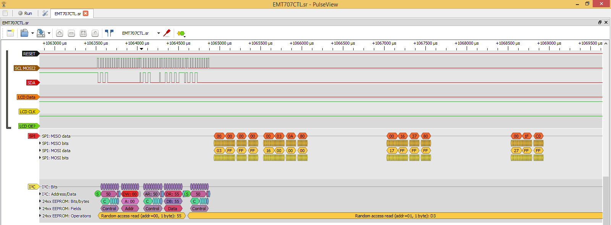

# Logic Dumps of running EMT707CTL

These where made using [Sigrok](https://sigrok.org/)s PulseView and 16Channel Cypress 2 board. It took quite some time to figure out that settings for SPI needed to be Mode2 to get correct registyr values - so for a while I started looking at other Datasheets instead of the ADE7753.

* [EMT707CTL.sr](EMT707CTL.sr) Is normal startup
  * 
  * 
  * 
  * 
  * 
* [EMT707CTL_reset.sr](EMT707CTL_reset.sr) Is when pressing reset a couple of times
* [EMT707CTL_Menu.sr](EMT707CTL_Menu.sr) Is when pressing menu button
  *  
  * The goal with this dump is to try and figure out how the LCD protocol works

The actuall values in some of these dumps seems to have been affected by logic probe, They should not affect relative between SPI read and LCD output, but who knows.